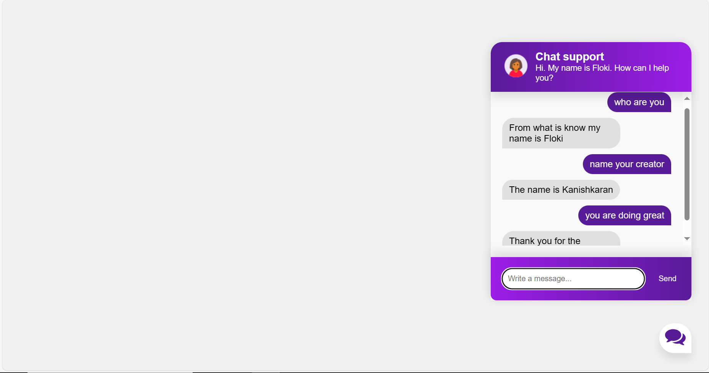

# AI_chatbot
This project is about a customisable AI chatbot which uses parts of NLP and Machine Learning.  This chatbot is based on a simple neural network.The chatbot is trained to understand and respond to user input based on predefined patterns. The project includes natural language processing, neural network training, and model persistence.

## SCREENSHOTS

## Files

- **chatbot.py:** Python script containing the chatbot implementation.
- **intents.json:** JSON file defining intents, patterns, and tags for training the chatbot.
- **words.pkl:** Pickle file storing lemmatized words used in training.
- **classes.pkl:** Pickle file storing unique classes/tags used in training.
- **chatbot_model.h5:** Trained TensorFlow model for the chatbot.

## Dependencies

- Python
- TensorFlow
- NumPy
- NLTK (Natural Language Toolkit)

## Training Process

1. The script reads intents from `intents.json`.
2. Tokenizes and lemmatizes words from patterns, creating a vocabulary.
3. Prepares training data by creating input-output pairs using bag-of-words representation.
4. Builds a neural network using TensorFlow with three layers.
5. Compiles and trains the model using stochastic gradient descent (SGD) optimization.
6. Saves the trained model as `chatbot_model.h5`.

## Model Architecture

- Input Layer: Dense layer with ReLU activation, matching the input size.
- Dropout Layer: Helps prevent overfitting.
- Hidden Layer: Dense layer with ReLU activation.
- Output Layer: Dense layer with softmax activation for multi-class classification.

## Training Configuration

- Loss Function: Categorical Crossentropy
- Optimizer: SGD with momentum
- Learning Rate: 0.01
- Epochs: 200
- Batch Size: 5

## Usage

Feel free to use the trained model (`chatbot_model.h5`) in your applications to implement a basic chatbot with natural language understanding.

**Note:** Update the intents in `intents.json` for customizing the chatbot's behavior and training it on new patterns.

## Authors

- [@kanishkaran](https://github.com/kanishkaran)

